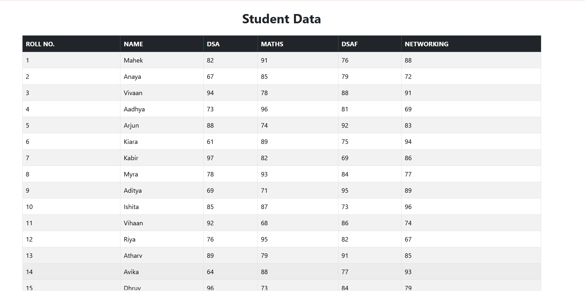

# 🎓 Student Data Management

A simple and responsive **Student Data Management** project built using **React JS, Bootstrap, and JSON Server**.

This project fetches student records from a local JSON Server API and displays them in a responsive Bootstrap table. It also includes pagination and a rows-per-page option for easy data navigation.

## 🚀 Features

* 📋 Display student records in a table
* 🔄 Fetch data using REST API
* 📄 Pagination system
* 🔢 Rows per page options: 5, 10, 25, 50, 100
* ⬅️ Previous and Next page buttons
* 📱 Responsive table using Bootstrap
* 🎨 Bootstrap styling
* 💾 Student data stored in JSON Server

## 🛠️ Technologies Used

* **React JS**
* **JavaScript**
* **Bootstrap**
* **JSON Server**
* **HTML / JSX**
* **REST API**

## 📊 Student Data

The project displays the following student information:

* Roll Number
* Student Name
* DSA Marks
* Maths Marks
* DSAF Marks
* Networking Marks

The student records are stored inside `db.json` under the `students` array.

## 📂 Project Structure

```text
student-data/
│
├── src/
│   ├── App.jsx
│   └── main.jsx
│
├── db.json
├── package.json
└── README.md
```

## ⚙️ Installation & Setup

### 1. Clone the Repository

```bash
git clone YOUR_GITHUB_REPOSITORY_LINK
```

### 2. Open the Project

```bash
cd student-data
```

### 3. Install Dependencies

```bash
npm install
```

### 4. Install Bootstrap

```bash
npm install bootstrap
```

### 5. Install JSON Server

```bash
npm install json-server
```

### 6. Start JSON Server

```bash
npx json-server --watch db.json --port 3000
```

The API will run at:

```text
http://localhost:3000/students
```

### 7. Start React Project

Open another terminal and run:

```bash
npm run dev
```

Then open the localhost link shown in the terminal.

## 📄 Pagination

The project uses pagination to display a limited number of students on each page.

By default, **5 students** are displayed per page. The user can change the number of records using the **Rows per Page** dropdown.

Available options:

```text
5
10
25
50
100
```

## 🔗 API

The project uses the following JSON Server endpoint:

```text
GET http://localhost:3000/students
```

The React application fetches the student data from this API and stores it in React state.

## 🖼️ Screenshot

### Student Data Table



## 🎥 Video Demo

Add your project video/demo link here:

```text
YOUR_VIDEO_LINK
```

## 👩‍💻 Author

**Mahek Kadri**

Frontend Developer | React JS Learner

## ⭐ Project

If you like this project, feel free to give the repository a ⭐ on GitHub.
